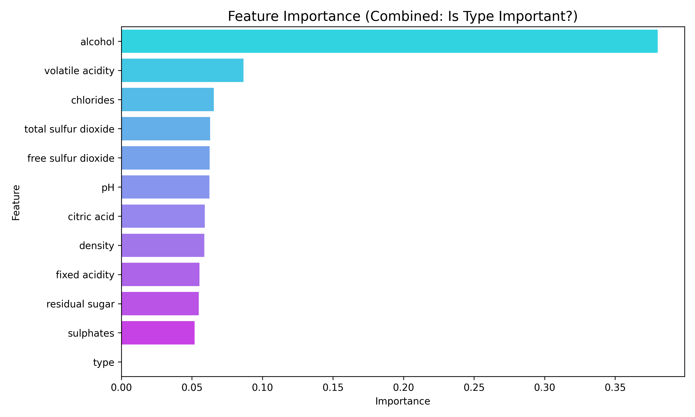
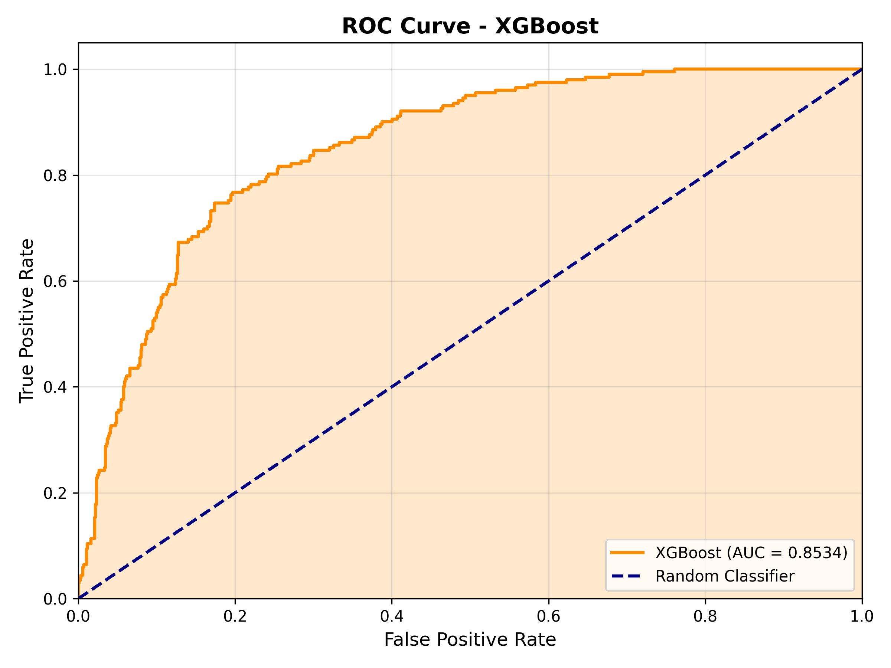
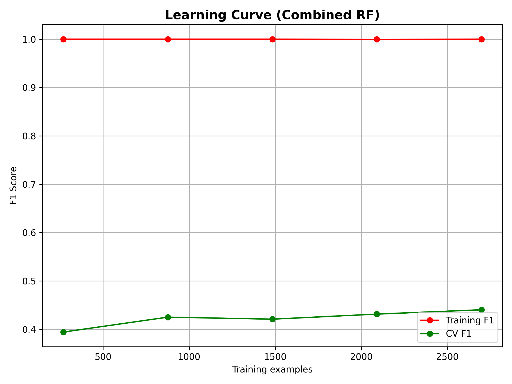

# Combined Wine Analysis: The Generalizability Experiment

## 1. Scientific Objective
The primary goal of this experiment was to test for **Simpson's Paradox** in wine quality. By merging Red and White datasets, we aimed to determine if chemical quality indicators are universal or type-specific.

## 2. Methodology
- **Data Augmentation:** Concatenated Red (1,599) and White (4,898) datasets (N=6,497).
- **Feature Engineering:** Added a binary `type` variable (0=Red, 1=White).
- **Hypothesis:** If `type` is a top feature, quality rules differ by wine color. If `type` is irrelevant, quality is universal.

## 3. Results & Findings

### 3.1. Feature Importance (The Verdict)

*Figure 1: Feature Importance ranking. The 'type' variable ranked last (Importance $\approx$ 0).*

**Scientific Conclusion:** The model completely ignored the wine type. This proves that **High Alcohol** and **Balanced Acidity** are universal markers of quality, regardless of whether the wine is Red or White.

### 3.2. Model Performance
We trained models on this combined "Universal" dataset to see if a single AI agent could handle both tasks.

| Model | Accuracy | F1-Score | ROC-AUC |
| :--- | :--- | :--- | :--- |
| **Combined Random Forest** | **84.3%** | 0.40 | 0.87 |
| **Combined XGBoost** | 81.0% | **0.58** | 0.85 |

**Statistical Significance:** A Paired T-Test confirmed that **XGBoost statistically significantly outperforms** Random Forest ($p < 0.05$) on this complex combined domain.

*Table 1: Test Results on the Combined Dataset.*

### 3.3. Interpretation
The **XGBoost** model achieved an **F1-Score of 0.58**, comparable to the standalone White Wine model. This proves that with a powerful enough model (Boosting), merging datasets acts as valid **Data Augmentation**, helping the model generalize general chemical patterns of "Quality" that transcend wine types.

### 3.4. ROC Curve Analysis

*Figure 2: ROC Curve for XGBoost model (AUC = 0.85) on combined dataset.*

### 3.5. Learning Curve & Overfitting Check

*Figure 3: Learning Curve showing no severe overfitting.*

### 3.6. Cross-Validation Score Distribution

*Figure 4: 10-Fold CV F1-Score Distribution. XGBoost shows higher mean and lower variance.*

## 4. Final Decision
There is no need for separate models in a production environment. A single, unified quality control system is viable and chemically sound.
