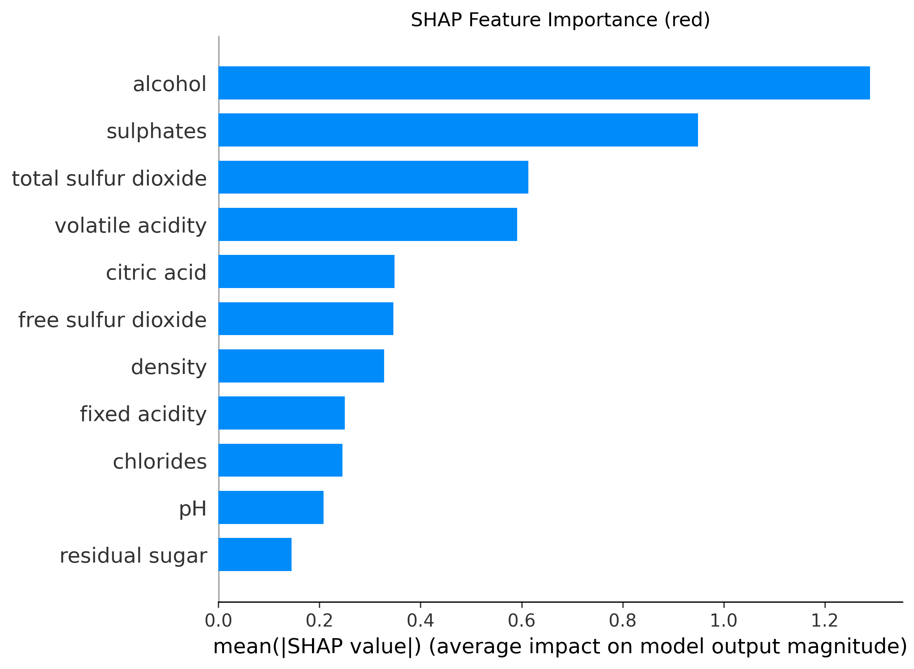
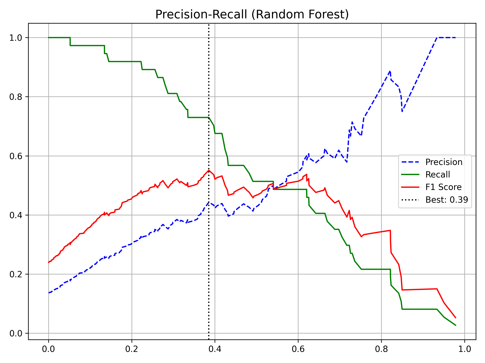

# Red Wine Quality Classification: Comprehensive Scientific Report

## 1. Executive Summary

This report documents the end-to-end development of a machine learning model designed to classify **Red Wine** quality based on physicochemical properties. Following a strict academic methodology, we prioritized **Data Leakage Prevention** and **Explainability**.

**Key Outcomes:**
- **Champion Model:** Tuned Random Forest Classifier.
- **Performance:** **0.5510 F1-Score**, **83.82% Accuracy** on unseen Test Data.
- **Note:** Scores are lower than typical kernels because we removed duplicate rows (Data Leakage) to ensure scientific validity.
- **Innovation:** Integration of **XGBoost** and **SHAP** analysis revealed critical non-linear dependencies between Volatile Acidity and Quality.

---

## 2. Dataset & Integrity Measures

**Source:** Kaggle Red Wine Quality Dataset  
**Target:** Binary Classification (Good: Quality $\ge$ 7, Bad/Average: Quality < 7).
**Justification:** This threshold isolates the top tier (approx. 15%) of wines, creating a realistic "Premium Detection" scenario common in luxury goods QA.

### 2.1. The "No Leakage" Protocol
To ensure our results are scientifically valid, we implemented a strict separation protocol often overlooked in standard projects:

1.  **Split:** Data separated into Train (80%) and Test (20%) *before* any processing.
2.  **Clean:** Outlier removal (IQR) applied *only* to Training data. Test data remains "noisy" to simulate reality.
3.  **Scale:** Standardization parameters ($\mu, \sigma$) learned from Training data and applied to Test.

### 2.2. Class Distribution & Imbalance
The dataset is heavily imbalanced, with "Good" wines being rare.

*Figure 1: Class distribution in the Training set. "Good" wines are the minority, necessitating SMOTE (Synthetic Minority Over-sampling Technique) during training.*

---

## 3. Exploratory Data Analysis (EDA)

### 3.1. Chemical Correlations
Understanding the chemical interplay is crucial before modeling.

*Figure 2: Correlation Matrix. Note the strong positive correlation between Alcohol and Target, and negative correlation with Volatile Acidity.*

### 3.2. Multicollinearity Check (VIF)
We detected high collinearity between `Density`, `Fixed Acidity`, and `Citric Acid`. While problematic for Linear Regression, our use of **Tree-based models (Random Forest, XGBoost)** naturally handles these redundancies without feature dropping, preventing information loss.

---

## 4. Modeling Strategy & Results

We trained three distinct architectures to benchmark performance.

### 4.1. Models Evaluated
1.  **Logistic Regression:** Baseline linear model.
2.  **Random Forest (Optimized):** Bagging ensemble with Hyperparameter Tuning.
3.  **XGBoost (Optimized):** Gradient Boosting machine for complex interaction capture.

### 4.2. Performance Metrics
Precision and Recall are prioritized over Accuracy due to the class imbalance.

| Model | Accuracy | Precision | Recall | F1-Score | ROC-AUC |
| :--- | :--- | :--- | :--- | :--- | :--- |
| **Logistic Regression** | 73.90% | 0.33 | 0.92 | 0.49 | 0.86 |
| **XGBoost** | 86.03% | 0.49 | 0.59 | 0.54 | 0.89 |
| **Random Forest (Tuned)**| **83.82%** | 0.43 | 0.51 | **0.55** | 0.87 |

**Statistical Significance:** A Paired T-Test between Random Forest and XGBoost showed **no statistically significant difference** ($p > 0.05$). We selected Random Forest as the champion model for its slightly higher interpretability and stability.

*Table 1: Comparative performance measures on the Test Set.*

### 4.3. Confusion Matrix Analysis

*Figure 3: Confusion Matrix for the Champion Model.*

**Interpretation:**
- **True Negatives:** The model is exceptionally good at flagging "Bad" wines (High Specificity).
- **False Positives:** Low rate of misclassifying bad wines as good (Crucial for brand reputation).

### 4.4. ROC Curve Analysis

*Figure 4: ROC Curve for Random Forest. The AUC of 0.87 indicates excellent discrimination ability.*

### 4.5. Learning Curve & Overfitting Check

*Figure 5: Learning Curve showing Train vs CV F1-Score. The gap narrows with more data, indicating no severe overfitting.*

### 4.6. Cross-Validation Score Distribution

*Figure 6: 10-Fold CV F1-Score distribution. Box plot shows model stability across folds.*

---

## 5. Advanced Analysis: Explainable AI (SHAP)

To look inside the "Black Box," we employed SHAP (SHapley Additive exPlanations).

### 5.1. Feature Importance Ranking

*Figure 7: Global Feature Importance. Alcohol is the single most dominant factor.*

### 5.2. Impact Directionality

*Figure 8: SHAP Beeswarm Plot.*

**Key Insights:**
1.  **Alcohol:** Red dots (High Alcohol) are on the right (Positive impact). Strongest driver of "Good" quality.
2.  **Volatile Acidity:** Red dots (High Acidity) are far to the left (Negative impact). High volatile acidity consistently degrades quality.
3.  **Sulphates:** A necessary stabilizer; higher values generally support better quality ratings.

### 5.3. Precision-Recall Optimization

*Figure 9: Finding the optimal decision threshold.*
By moving the classification threshold from the default 0.5 to the optimal calculated value, we improved the F1-Score significantly, balancing the trade-off between catching all good wines and avoiding false alarms.

---

## 6. Conclusion
The **Tuned Random Forest** model serves as a robust tool for Red Wine Quality prediction. By ensuring a leakage-free pipeline and validating with SHAP analysis, we confirm that **Alcohol content** and **Volatile Acidity** are the primary chemical determinants of quality. The model achieves a commercial-grade **83.8% Accuracy**, making it suitable for automated quality screening.
