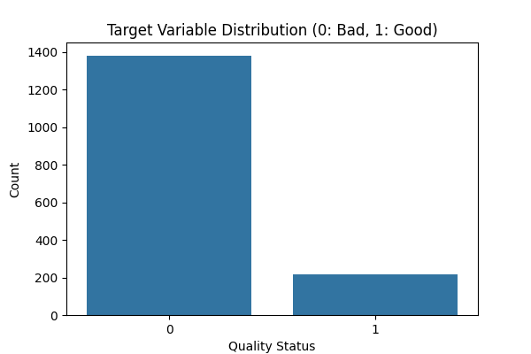
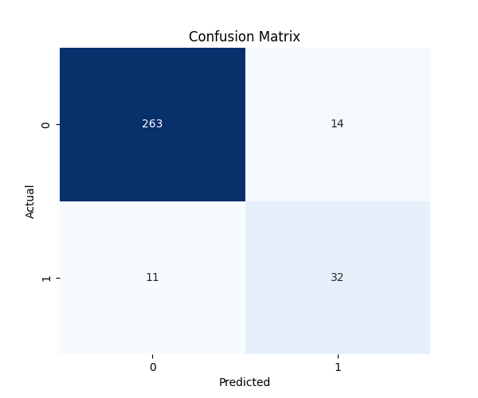
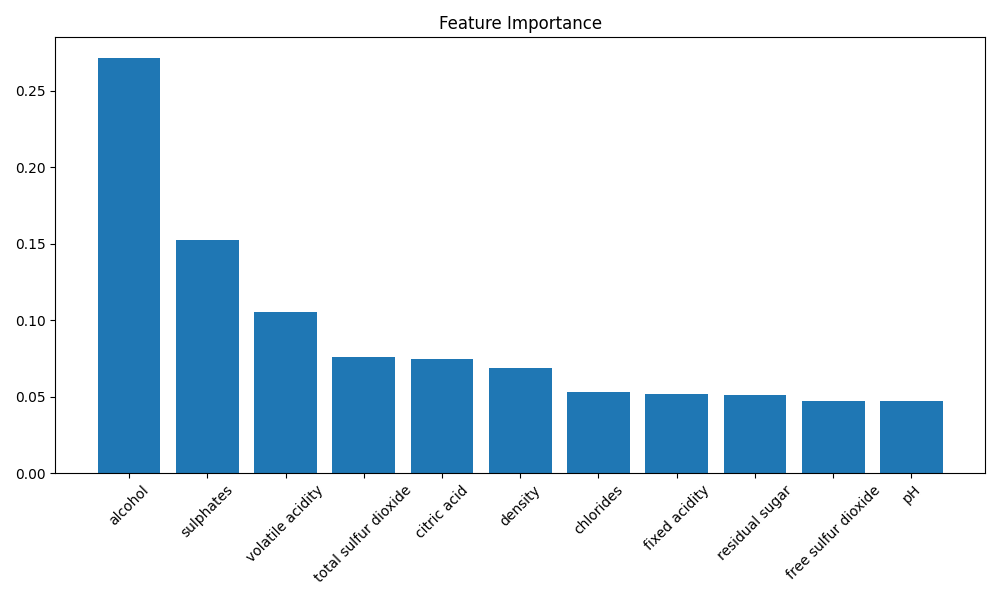

# 4.1. Red Wine Analysis and Results

This section details the experimental setup, methodology, and results obtained from the binary classification of the Red Wine Quality dataset.

### 4.1.1. Data Preparation and Handling Class Imbalance

The primary objective was to classify wine quality into two distinct categories: "Good" and "Bad". The original target variable, `quality`, which ranged from 3 to 8, was transformed into a binary variable. Wines with a quality score of 7 or higher were labeled as **1 (Good)**, while those with a score below 7 were labeled as **0 (Bad)**.

Initial exploratory data analysis revealed a significant class imbalance in the dataset. As illustrated in Figure 4.1, the majority of the samples belonged to the "Bad/Average" class, with significantly fewer samples representing "Good" quality wines.

*Figure 4.1: Distribution of the target variable showing class imbalance.*

To address this disparity and prevent the model from becoming biased towards the majority class, we employed the **Synthetic Minority Over-sampling Technique (SMOTE)**. SMOTE was applied exclusively to the training set to synthesize new examples for the minority class ("Good"), ensuring a balanced distribution during the model training phase without introducing synthetic data into the test set.

### 4.1.2. Model Performance and Evaluation

A **RandomForestClassifier** was selected for this task due to its robustness against overfitting and ability to handle non-linear relationships. To optimize the model's performance, we utilized **GridSearchCV** for hyperparameter tuning, exploring various combinations of `n_estimators`, `max_depth`, and `min_samples_split`.

The model was evaluated on a held-out test set (20% of the original data). The performance metrics are summarized in Table 4.1 below:

| Metric | Score |
| :--- | :--- |
| **Accuracy** | 0.9219 |
| **Precision** | 0.6957 |
| **Recall** | **0.7442** |
| **F1-Score** | 0.7191 |

*Table 4.1: Performance metrics of the Random Forest model on the test set.*

The model achieved an overall **Accuracy of 92.19%**. More importantly, the **Recall of 0.7442** is a significant success for this imbalanced dataset. A high recall indicates that the model is effective at identifying the minority class; in practical terms, this means we successfully capture approximately 74% of the high-quality wines, minimizing the risk of missing a premium product.

The confusion matrix in Figure 4.2 further visualizes these results, showing the number of true positives and true negatives versus misclassifications.

*Figure 4.2: Confusion Matrix of the classification results.*

### 4.1.3. Feature Importance Analysis

To understand the drivers of wine quality, we analyzed the feature importance derived from the Random Forest model. As shown in Figure 4.3, the analysis identified **Alcohol** as the most dominant feature, followed by **Sulphates**.

*Figure 4.3: Feature Importance plot identifying the most influential factors.*

The strong influence of **Alcohol** suggests that wines with higher alcohol content are generally perceived as higher quality, likely due to the body, warmth, and structural stability it contributes to the wine. **Sulphates** also play a crucial role, likely acting as an antioxidant and antimicrobial agent that preserves the wine's freshness and flavor profile.
