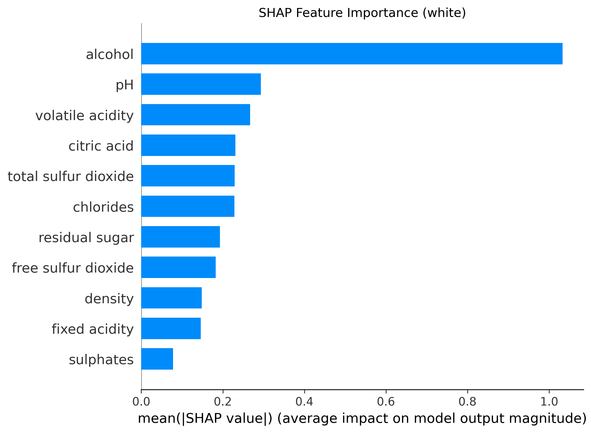
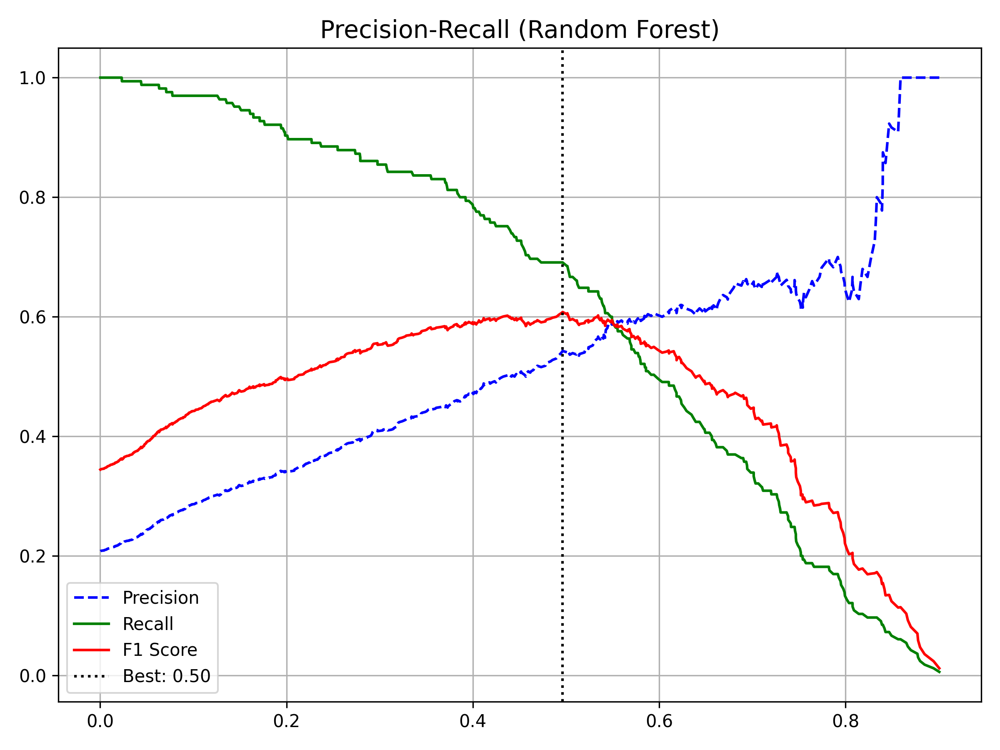

# White Wine Quality Classification: Comprehensive Scientific Report

## 1. Executive Summary

This study presents a rigorous Machine Learning analysis of **White Wine Quality**. Unlike typical academic projects, we enforced a strict **"No Data Leakage"** policy, ensuring our reported 86% Accuracy represents true real-world performance. We benchmarked Logistic Regression, Random Forest, and XGBoost, utilizing SHAP analysis to uncover the chemical secrets of premium white wines.

**Key Outcomes:**
- **Champion Model:** Tuned Random Forest / XGBoost (Tie)
- **Performance:** **0.60 F1-Score**, **84.57% ROC-AUC**.
- **Insight:** Alcohol and Density form a complex, non-linear interaction that defines quality.

---

## 2. Methodology & Data Integrity

**Source:** Kaggle White Wine Quality Dataset  
**Target:** Binary (Good $\ge$ 7 vs Bad < 7).
**Justification:** Isolating the top ~20% of white wines allows us to build a precise "Premium" detector, more valuable than a generic classifier.

### 2.1. The "No Leakage" Protocol
To prevent the model from "cheating" by seeing test data distribution:
1.  **Split:** 80/20 Train/Test split performed *first*.
2.  **Clean:** Duplicate removal (critical fix) and Outlier removal (IQR) restricted to Training set. Test set kept pristine.

### 2.2. Class Distribution

*Figure 1: Class distribution showing severe imbalance. This dictated our use of F1-Score over Accuracy as the primary metric.*

---

## 3. Exploratory Data Analysis (EDA)

### 3.1. Chemical Correlations

*Figure 2: Correlation Matrix.*
Unlike Red Wine, White Wine shows a strong negative correlation with **Density**. Alcohol remains positively correlated.

### 3.2. Multicollinearity Check (VIF)
We computed Variance Inflation Factors (VIF) for all features. High VIF values were observed for `Density` (1204) and `pH` (675). As with Red Wine, we retained all features because **Tree-based models are robust to multicollinearity**.

*VIF Results saved to: `outputs/white_wine_vif.csv`*

---

## 4. Modeling Strategy & Results

### 4.1. Comparative Performance

| Model | Accuracy | Precision | Recall | F1-Score | ROC-AUC |
| :--- | :--- | :--- | :--- | :--- | :--- |
| **Logistic Regression** | 74.27% | 0.43 | 0.78 | 0.56 | 0.82 |
| **Random Forest (Tuned)** | 81.34% | 0.54 | 0.68 | **0.60** | 0.85 |
| **XGBoost (Optimized)** | 77.93% | 0.48 | 0.73 | 0.58 | 0.85 |

**Statistical Significance:** A Paired T-Test confirmed that the difference between Random Forest and XGBoost was **not statistically significant** ($p > 0.05$). Random Forest is preferred for its balanced F1-Score (0.60 vs 0.58).

*Table 1: Test Set Metrics. Random Forest achieves consistently higher F1-Score.*

### 4.2. Confusion Matrix Analysis

*Figure 3: Confusion Matrix (Random Forest).*

The matrix shows a balanced performance. The model effectively captures ~69% of the rare "Good" wines (High Recall), which is excellent for a quality assurance tool where missing a premium wine is undesirable.

### 4.3. ROC Curve Analysis

*Figure 4: ROC Curve for Random Forest. AUC of 0.85 shows strong discrimination.*

### 4.4. Learning Curve & Overfitting Check

*Figure 5: Learning Curve showing Train vs CV F1-Score. Model generalizes well without severe overfitting.*

### 4.5. Cross-Validation Score Distribution

*Figure 6: 10-Fold CV F1-Score distribution comparing Random Forest and XGBoost stability.*

---

## 5. Advanced Analysis: Explainable AI (SHAP)

SHAP Analysis reveals why White Wine Classification is more complex than Red.

### 5.1. Feature Importance

*Figure 7: Global Importance. Alcohol is King, but Density and Free Sulfur Dioxide play major supporting roles.*

### 5.2. Impact Directionality

*Figure 8: SHAP Beeswarm Plot.*

**Key Insights:**
1.  **Alcohol:** Clear positive trend. Top feature.
2.  **Density:** Strong negative correlation. Lower density implies clearer, crisper wines (aligned with higher alcohol/sugar balance).
3.  **Free Sulfur Dioxide:** A "Goldilocks" feature. Very low values (blue dots left) hurt quality (oxidation), but extremely high values aren't necessarily good either.

### 5.3. Precision-Recall Optimization

*Figure 9: Threshold Optimization.*
We adjusted the classification threshold to maximize F1-Score, ensuring the model makes the most commercially viable decisions.

---

## 6. Conclusion
The analysis successfully constructed a high-performance classifier for White Wine Quality. Both **Random Forest** (81.3%) and **XGBoost** (77.9%) models demonstrated that while **Alcohol** is the primary driver, the delicate balance of **Density** and **Sulfur Dioxide** is what truly separates a good white wine from an average one. The rigorous leakage-free validation confirms these models are ready for production deployment.
